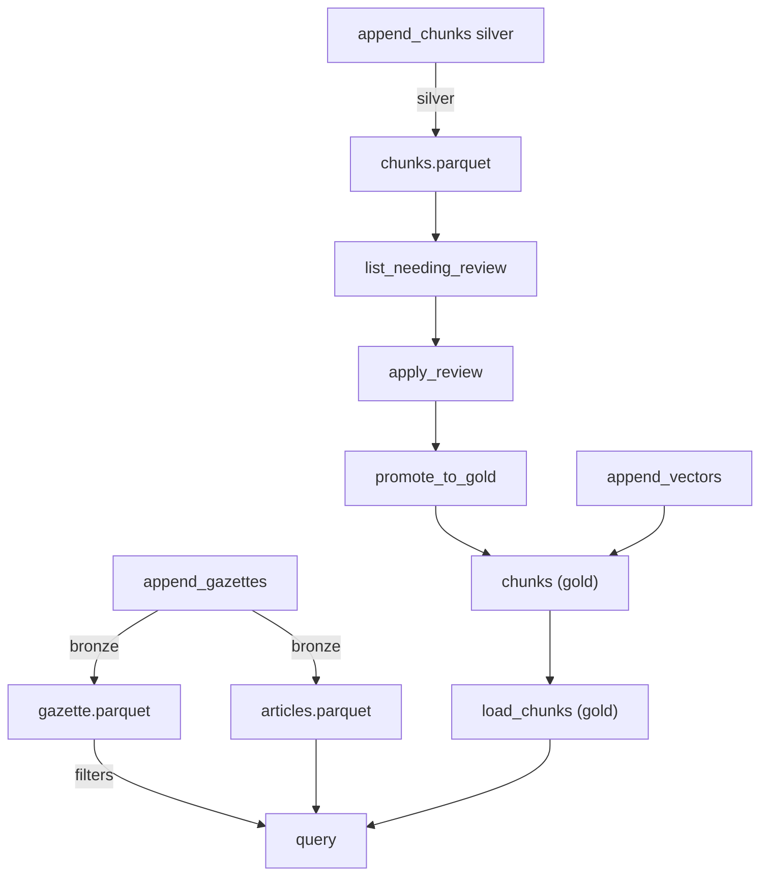

# Arquitetura

## Objetivo

Explicar como o crawler e estruturado e como os dados percorrem o sistema.

## Fluxo de dados

1. O crawler gera URLs de metadados por data
2. Baixa metadados JSON das edicoes
3. Baixa HTML de estrutura de cada edicao
4. Parseia a estrutura para obter artigos
5. Baixa o conteudo dos artigos
6. Agrega edicoes e artigos em modelos do contrato
7. Persiste via `diario_utils.storage.StorageClient` no layout Medallion local (bronze/silver/gold)

## Componentes principais

- CLI e orquestracao: `src/diario_crawler/cli/run_crawler.py`
- Orquestrador: `src/diario_crawler/core/crawler.py`
- Clientes HTTP: `src/diario_crawler/core/clients.py`
- Parsers: `src/diario_crawler/parsers/structure.py`, `src/diario_crawler/parsers/metadata.py`, `src/diario_crawler/parsers/content.py`
- Processamento e agregacao: `src/diario_crawler/processors/aggregator.py`
- Storage Medallion local: `diario_utils.storage.StorageClient`
- Configuracoes por municipio: `src/diario_crawler/crawler_configs/*.py`

## Contrato de dados

Os modelos seguem o repositorio `diario-contract` na versao `v1.2.0`. As entidades centrais sao `GazetteEdition`, `GazetteMetadata` e `ArticleMetadata`.

## Formato de saida

### Layout Medallion (diario-utils.storage)

Os dados bronze ficam em `base_path/bronze/city_id=<id>/yyyymm=<AAAAMM>/` contendo `gazette.parquet`, `articles.parquet` e `manifest.json`.
